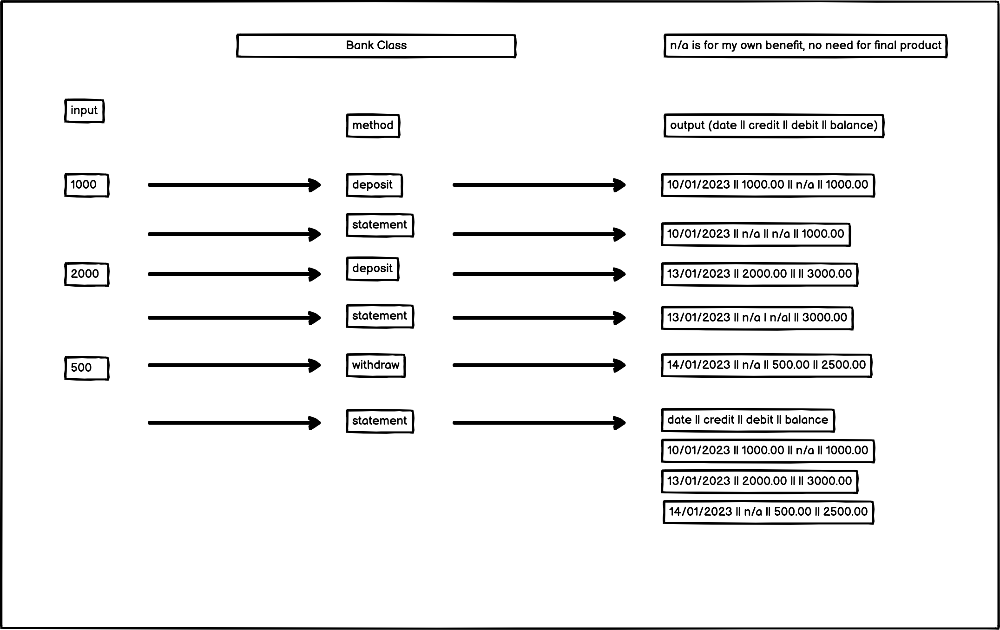
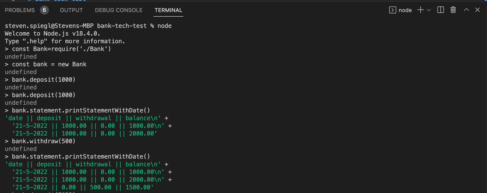
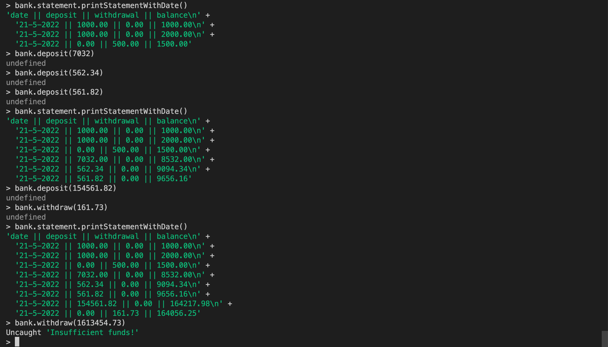

# bank-tech-test
#diagrams 

# Instructions:
A user can use the program to deposit or withdraw money to/from a bank account. You cannot withdraw more than you have in the account. 

To run the program, run the following in the terminal inside the program folder:
npm install

Then enter the following in node:
const Bank = require('./Bank')
const bank = new Bank

Now you can add money, withdraw money and view a statement.

Add money using bank.deposit(funds)
e.g. bank.deposit(100)

Withdraw money using bank.withdraw(funds)
e.g. bank.withdraw(100)

print a statement using the printStatementWithDate() function,
e.g. bank.statement.printStatementWithDate() 

# questions/notes for Eóin, with reference to the guidance:

My ultimate plan was to have three classes, Bank, Statement and Account, with Account and Statement being created in the Bank constructor and Account being injected into Statement here, since it's necessary to calculate the statement. I managed this, but while I could wrap the ability to deposit or withdraw funds in a Bank function quite neatly, so that I could simply call bank.deposit(funds) and it would access and increment the account, I couldn't do the same for the statement. I had hoped to be able to simply write bank.printStatementWithDate() and have the following logic take place (I've shortened the code just to include the relevant method):

  class Bank {
    constructor() {
      this.account = new Account();
      this.statement = new Statement(this.account);
    }

    printStatementWithDate() {
      this.statement.printStatement;
    }
  }

However, this just resulted in undefined, so I had to call the statement, e.g. bank.statement.printStatementWithDate(), which is not ideal. I thought it might be to do with creating a new instance of statement in the constructor i.e. maybe it was generating a new instance every time and wiping the data, but even statement methods that didn't rely on input, e.g a test function within the Statement class that just returned a string, did not work, which I assume means I'm not injecting things properly in the constructor. 

Also, if you look at the statement tests, you'll see they deposit via the account, not via the bank. I know that a user would deposit via the bank according to how I have written the code, but depositing via the bank for some reason did not work...

Also, some of the statement tests seem superfluous, as by the end the things that they were testing for individually (e.g. includes a date) were required in each test and were thus all being tested in each test. I have a suspicion this comes down to testing state over behaviour, but am not sure how to rectify. Any pointers would be great, since as I mention below, the required form for the output seems quite rigid. 

I wanted to regex out the \n, but couldn't think of another way to keep the output on separate lines. I was able to do this using console.log(), using it as I might have used puts in ruby to generate output on separate lines, but I couldn't find a way to properly test the log output. I'm curious to know what the right approach would have been. 

The below are my notes regarding some of the criteria, with a couple of questions (sorry for the length): 

*Ask each class, spec and method/function what it does, if the reply involves the word "and" you probably need to refactor. (normal)*

  - account - contains the balance
  - statement - generates a statement based on the account with a header for clarity and formatting for readability 
  - bank - allows the user to put money into and take money from their account. It's also here where the user accesses and runs functions on the statement.

- I did not mock the date, the reason being I had some problems with general implementation and having struggled to mock the date at the beginning I was reluctant to spend too much time trying it at the end. I would like to discuss this/some starting points of where to look at how to do this, if possible. I feel like the only way the tests would fail is if they were run at midnight and the date changed in the few seconds they took to run...

- There is mention of needing to avoid a transaction class that has a method that prints itself ... what would a transaction class look like? does this mean statement class? should the statement be printed from within bank? And if so, does this mean a printStatement function that is defined in Statement but called from bank, or does it mean all of the work is done from within Bank, or even a Print class?

- The feature tests don't use a test framework, as far as I'm aware ... Eóin, would you be able to explain this a bit more to me? My understanding of feature tests is that in this context they would be run from node, with the developer simulating input from a user, since the REPL is where the interaction will take place. If we were building an app, presumably we'd use cypress or something similar for feature tests, but in this context I'm unsure how a framework could be used for feature tests.

- One class is significantly longer than all of the others, but falls within the size constraints of the additional requirements (no longer than 50 lines). Is this acceptable?

- I'm not sure I made the best decision about how to instantiate and use the header...

- *'Do you test for behaviour, rather than state?' (additional)...* not really, I have to change the tests
every time I change the code, which isn't ideal, but the spec shows the data being returned in a very
distinctive manner, i.e with || between figures and words, which I've tried to replicate... not sure how to test in a way that checks the format without testing for state

- *do your test descriptions read clearly (additional)*

- *Do you make appropriate use of the testing framework's methods to keep your test code clean? (additional)* - I believe so, but am keen for feedback. 

- *Do you have a clear separation between your program logic and output? (additional)* - not sure. Most of the logic is in statement, the exception being the overdraft prevention method...

- If you loop through an array passing a block of code with puts in it: you're calling `puts` for each loop. Aim to construct the string representation of the statement before calling `puts`. (additional) ... I *think* I do this but I'm not sure, so would like feedback in this area.

- Do your unit tests mock the dependencies of the object they are testing? (normal) - I don't think so... again, would appreciate any pointers in this area...

Does the linter (e.g. Rubocop, ESLint) pass with no warnings? (normal) - no, but the remaining messages don't make much sense to me. 

*Are your variable, method, & class names clear and descriptive? (normal)* - I think so...
